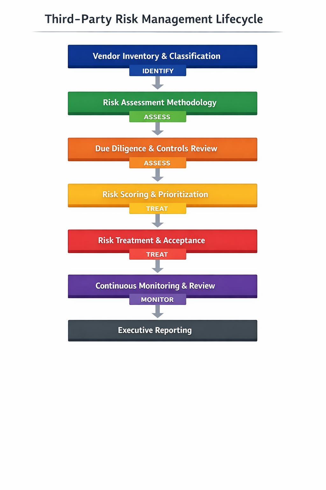

# Third-Party Risk Management (TPRM)

## Executive Summary

This repository presents a practical, end-to-end **Third-Party Risk Management (TPRM)** model focused on how organizations assess, prioritize, and govern vendor risk in real-world environments.

Rather than treating third-party risk as a compliance checkbox, this project emphasizes **risk-based decision-making**, evidence-driven due diligence, and continuous monitoring aligned with business and regulatory expectations.

The content is designed to reflect how mature security and risk teams manage vendor risk across the full lifecycle — from onboarding to ongoing oversight and executive reporting.

---

## Objectives

- Establish a structured approach to identifying and classifying third-party vendors  
- Assess vendor risk based on likelihood and business impact  
- Perform due diligence beyond certifications and self-attestations  
- Support defensible risk treatment and acceptance decisions  
- Enable continuous monitoring and audit-ready documentation  
- Translate vendor risk into executive-level insight  

---

## Scope

This project covers:

- Vendor inventory and risk tiering  
- Risk assessment methodology and scoring  
- Due diligence and security controls review  
- Risk treatment, mitigation, and acceptance  
- Continuous monitoring and reassessment  
- Executive and audit-oriented reporting  

This project **does not represent production systems or real organizational data**.  
It focuses on governance processes, decision logic, and risk management thinking.

---

## Repository Structure

- **vendor_inventory.md**  
  Defines how vendors are identified, classified, and tiered based on criticality and access.

- **risk_assessment_methodology.md**  
  Describes how likelihood and impact are evaluated to identify vendor risk scenarios.

- **risk_scoring_and_prioritization.md**  
  Explains how risks are scored and prioritized to guide mitigation and acceptance decisions.

- **due_diligence_and_controls_review.md**  
  Details how vendor security controls and evidence are evaluated beyond certifications.

- **risk_treatment_and_acceptance.md**  
  Documents mitigation strategies, compensating controls, and formal risk acceptance.

- **continuous_monitoring_and_review.md**  
  Defines how vendor risk is monitored over time and reassessed based on change triggers.

- **executive_reporting.md**  
  Translates vendor risk posture into metrics and summaries for leadership and audit review.

---

## Framework Alignment

This project aligns conceptually with:

- **ISO/IEC 27001** — Risk-based control selection and monitoring  
- **NIST Cybersecurity Framework (CSF)** — Govern, Identify, and Monitor functions  
- **NIST SP 800-30 / 800-37** — Risk assessment and risk management lifecycle  
- **Regulatory expectations** (e.g., NIS2, DORA) regarding third-party oversight  

---

## Key Takeaway

Third-party risk cannot be eliminated — it must be **understood, governed, and consciously accepted** where appropriate.

Effective TPRM is not about perfect vendors, but about **making informed, documented, and defensible risk decisions** that align security with business reality.

---

## Scope & Intent Disclaimer

These materials represent **how I think about cybersecurity governance and risk decisions**,  
not systems I personally operated or managed in a production environment.

